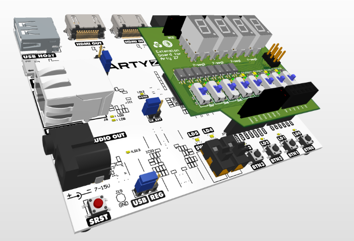

# Digital Clock System on Arty Z7

A comprehensive digital clock implementation for the Arty Z7 FPGA development board, featuring time, date, alarm, and stopwatch functionality. This project demonstrates hardware design concepts including clock management, finite state machines, and user interface implementation.

## Hardware Platform



The Arty Z7 development board features a Xilinx Zynq-7000 All Programmable SoC, which integrates a dual-core ARM Cortex-A9 processor with Xilinx 7-series FPGA programmable logic.

## Features

### Time Display
- 24-hour format display (00:00 to 23:59)
- Button controls for setting hours and minutes
- Accurate timekeeping using 1Hz clock generation

### Date Management
- Month and day display
- Automatic month rollover
- Proper handling of different month lengths
- February set to 28 days (non-leap year)

### Alarm System
- Settable alarm time
- Visual alarm indication using alternating red/blue LEDs
- Temporary alarm time display when setting
- Enable/disable alarm functionality

### Stopwatch
- Range: 00:00 to 99:59
- Start/Stop functionality
- Reset capability
- Independent operation from main clock

## Hardware Requirements

- Arty Z7 FPGA Development Board with extension board

## Control Interface

### Switches
- SW0: Alarm Mode Enable/Disable
- SW1: Display Mode Toggle (Time/Date)
- SW2: Stopwatch Mode Enable
- SW3: Stopwatch Start/Stop

### Buttons
When SW1 is ON (Time Mode):
- BTN0: Increment Minutes
- BTN1: Increment Hours
- BTN2: Increment Alarm Minutes
- BTN3: Increment Alarm Hours

When SW1 is OFF (Date Mode):
- BTN0: Increment Day
- BTN1: Increment Month

## Project Structure

```
CLOCK_PROJECT/
├── RTL_Code/                    # Core RTL implementation
│   ├── clock_system_top.v      # Top-level system integration
│   ├── digital_clock.v         # Main clock functionality
│   ├── date_handler.v          # Date management
│   ├── alarm_clock.v           # Alarm functionality
│   ├── stop_watch.v           # Stopwatch implementation
│   ├── display.v              # 7-segment display driver
│   ├── clock_divider.v        # Clock generation (1Hz)
│   ├── buttons.v              # Button input handling
│   ├── alarm_indicator.v      # LED control for alarm
│   └── edge_detector.v        # Button debouncing
│
└── RTL_Testbench/              # Verification
    ├── clock_system_top_tb.v   # System-level testbench
    ├── digital_clock_tb.v      # Clock module tests
    ├── date_handler_tb.v       # Date handling tests
    ├── alarm_clock_tb.v        # Alarm function tests
    ├── stop_watch_tb.v        # Stopwatch tests
    ├── display_tb.v           # Display driver tests
    └── edge_detector_tb.v     # Input handling tests
```

## Testing

Each module includes a dedicated testbench for verification:
- Button debouncing verification
- Clock division accuracy tests
- Display pattern verification
- Time/date rollover tests
- Alarm triggering tests
- Stopwatch functionality tests

## Tools Used

- Vivado Design Suite
- Verilog HDL
- Arty Z7 Development Board
